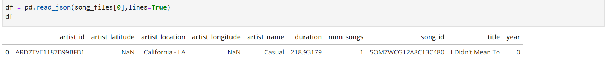
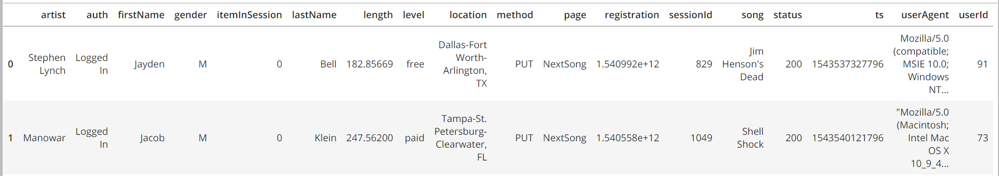
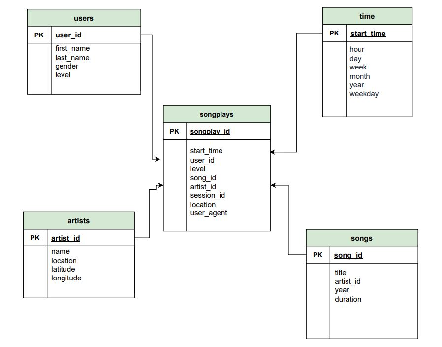
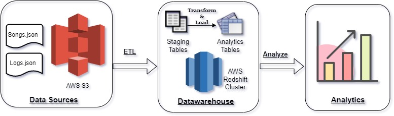

# Introduction

Sparkify is a music streaming startup whose user and music metadata resides in AWS cloud as json files in AWS S3 buckets.  Based on the song and user-activity data collected in JSON files by the Sparkify team, a database is to be built in redshift cluster.This project is an implementation of an ETL pipeline to extract data from S3 and load it to aws redshift staging tables and finally into analytics tables after processing it.  The Analytics team at Sparkify will further  use the processed data to derive useful insights for their business.

# Dataset:
Below are the two input files used in this project, both the files reside on AWS S3:
### 1. <i>Song Dataset</i>
<b> File Path </b> : s3://udacity-dend/song_data

The first dataset consists of song files in JSON format. These files contain metadata about a song and the artist of that song. The files are partitioned by the first three letters of each song's track ID. Below is the snippet of example of how song dataset looks like:

### 2. <i>Log Dataset</i>
<b> File Path </b> :s3://udacity-dend/log_json_path.json

The second dataset consists of log files in JSON format generated by this event simulator based on the songs in the dataset above. The log files in the dataset are partitioned by year and month. Below is the snippet of example of how log dataset looks like:

# Database Model:
### 1. <i>Staging tables</i>
Two staging tables have been created to load raw data as it is from S3 into redshift cluster:
 - **staging_events**: contains data from log json files.
 - **staging_songs**: contains song and artist data from song json files. 

### 2. <i>Analytics Tables</i>
Below is the conceptual design for the final analytical Sparkify datawarehouse in AWS Redshift. The following ***design strategies*** have been incorporated:
 1. Since the database is supposed to support heavy analytical queries, a **star schema** has been designed.
 2. The different components of star schema incudes:
     **Fact Table**: songplays 
     **Dimension Table**: songs, artists, users, time
 3. These tables have been designed to achive storage and data retrival optimisation.
     - **Songplays**: This fact table could be a big one hence it has start_time as SORTKEY and distributed by user_id as DISTKEY.
     - **Songs**: This dimension table could be a big one hence it has song_id as DISTKEY.
     - **Artists**: This dimension table could be relatively small  hence it has artist_id as SORTKEY and distribution style as ALL.
     - **Users**: The user base of Sparkify App is increasing, hence this could be a big dimension table therfore it has user_id as DISTKEY.
     - **Time**: This dimension table can have many rows as it records time details of records from Songplays table one hence it has start_time as SORTKEY and distributed by year as DISTKEY.

# ETL Pipeline:
- ETL processing has been implemented by using python  libraries like psycopg2 and sql queries.
- Firstly, by using COPY command raw data is uploaded from S3 buckets to staging tables(staging_events, staging_songs) in redshift cluster parallely.
- Then, with the use of SQL queries data is extracted from staging tables and after processing(using the queries) data is loaded into above created analytics tables(users, songs, artists, time, songplays).
- This processed data can be used by Sparkify analytics team to perform further analysis.

# Project Files and Folders:
1. <b>dwh.cfg:</b> Contains configuration settings for Sparkify database in redshift cluster and aws role and ARN details to execute this code in AWS .
2. <b>create_tables.py:</b> contains python code to connect to the database in redshift cluster, drop existing tables and to create new ones and, finally close db connection. You run this file to reset your tables before each time you run your ETL scripts.
3. <b>etl.py:</b> contains python code to connect to the database in redshift cluster, load staging tables with input data in S3 buckets and to insert new processed records into sparkify analytical tables. Since, not a large amount of processing and transformation was to be done, therefore data has been processed here in insert queries itself, same could have been handled in python code as well.
4. <b>sql_queries.py:</b> contains all sql queries to drop, create and insert records in staging and analytics tables.
5. <b>README.md:</b> provides breif description about the project and how to run the files.

# Steps to run the project:
Follow the below steps to run the project:
1. **AWS & dwh.cfg**: Create IAM Role for redshift cluster to read data from S3, create security group for reshift cluster to be accessed from outside, launch redshift cluster and fill all the details in dwh.cfg file.
2. **create_tables.py** : run this file to create DB, drop existing tables and create the new tables.
3. **etl.py**: run this file to read and load data from S3 to staging tables and finally process and load data to final analytics tables in a db in redshift cluster.
